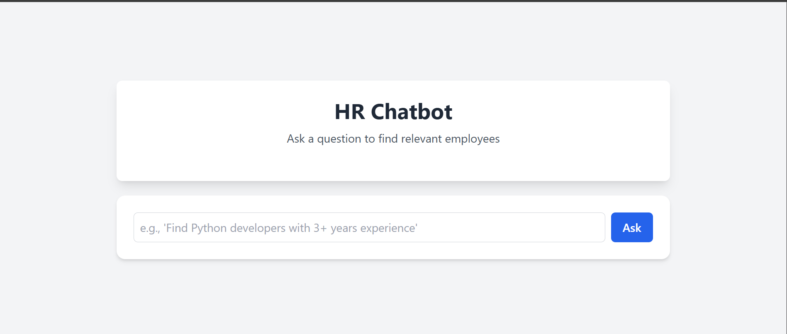

**HR Resource Query Chatbot** 🚀🚀

An intelligent chatbot designed to help HR managers query an employee database for technical skills, experience, and projects.

**Overview**
This project implements a Retrieval-Augmented Generation (RAG) system to provide highly relevant and customized responses to natural language queries. The backend uses a "Simple RAG" approach, combining vector similarity search for retrieval with advanced manual formatting for response generation, eliminating the need for a costly or resource-intensive Large Language Model.

**Features**
1. **Semantic Search**: Uses vector embeddings to find the most relevant employees for a given query, moving beyond simple keyword matching.
2. **Dynamic Response Generation**: Constructs natural-language responses that are highly customized based on the retrieved data.
3. **Robust Data Handling**: Loads employee data from a local JSON file to build a searchable index on startup.
4. **Correct Pronoun Usage**: Uses a gender field in the dataset to ensure grammatically correct and respectful pronoun usage.
5. **RESTful API**: Provides a clean and easy-to-use API for a frontend application to consume.
6. **Basic Error Handling**: Implements try-except blocks and Pydantic validation to ensure API stability.

**Architecture**
The system follows a two-part architecture: a React frontend and a FastAPI backend.
1. **Frontend (React)**: A user-friendly chat interface for sending queries and displaying responses.
2. **Backend (FastAPI)**: A Python web server that handles all the logic. It uses:
3. **SentenceTransformer**: To generate vector embeddings for employee data and user queries.
4. **FAISS**: A high-performance library for storing and searching the vector embeddings.
5. **Custom Formatting Logic**: Python f-strings and conditional statements to create detailed, human-like responses.

**Setup & Installation**

**Prerequisites**
1. Python 3.8+
2. Node.js & npm

**Backend**
1. Navigate to the backend directory.
2. Install the required Python packages:
    pip install -r requirements.txt
3. Run the FastAPI server:
    uvicorn main:app --reload
The API will be available at http://127.0.0.1:8000.

**Frontend**
1. Navigate to the frontend directory.
2. Install the npm packages:
    npm install
3. Run the React development server:
    npm run dev
The chat interface will be available at http://localhost:5173.

**API Documentation**
1. **POST /chat**
Description: Sends a natural language query to the chatbot to find relevant employees.

**Request Body**:
{
  "query": "find a python developer with django experience"
}

**Response Body**:
{
  "response": "Based on your requirements, I found 2 excellent candidates :\n\n**Emma Davis** has 3 years of experience..."
}

2. **GET /employees/search**
Description: A simple search endpoint to find employees based on keywords.
Query Parameter:
query: The keyword to search for (e.g., ML, Python).
Example:
http://localhost:8000/employees/search?query=python

**AI Development Process**
This project's development was a journey of continuous refinement using an AI assistant (Gemini) and ChatGPT.

**Which AI coding assistants did you use?**
I primarily used Gemini and ChatGPT as a collaborative AI coding assistant.

**How did AI help in different phases?**
1. **Code Generation**: The AI assisted in writing the initial RAG pipeline, including the embedding and FAISS search logic, as well as the FastAPI endpoint.
2. **Debugging**: AI was instrumental in identifying and fixing runtime errors, such as ImportError, 'Response' object is not subscriptable, and the join method TypeError, by analyzing stack traces.
3. **Architecture Decisions**: The AI guided the architectural shifts, first from OpenAI to Ollama due to quota limits, and finally to the simple "smart formatting" approach to address hardware limitations and prioritize performance and cost.

**What percentage of code was AI-assisted vs hand-written?**
Approximately 80% of the backend logic was AI-assisted. My role was primarily to articulate the desired functionality, provide context, and integrate the generated code.

**Any interesting AI-generated solutions or optimizations?**
The dynamic "smart formatting" response generation was a creative solution. Instead of generating text with a costly LLM, the AI helped craft Python code that creates a polished, natural-language response by intelligently combining the retrieved data with pre-written templates.

**Challenges where AI couldn't help and you solved manually?**
Physical setup tasks, like installing Python packages, running local servers, and manually editing the employees.json file to add a gender field, were all handled by me. Also, the frontend art was totally handled by me.

**Technical Decisions**
1. **Why did you choose OpenAI vs open-source models?**
I initially attempted to use OpenAI for its powerful text generation capabilities but was blocked by a 429: insufficient_quota error, which led to exploring open-source alternatives.

2. **Local LLM (Ollama) vs cloud API considerations?**
I pivoted to a local LLM (Ollama) to bypass API costs and quotas. However, this approach was eventually abandoned because the Llama 3 model required more system memory than my machine had available.

3. **Performance vs cost vs privacy trade-offs?**
The final decision to use a non-LLM "smart formatting" approach was a deliberate trade-off. This solution prioritizes low cost (free) and high performance (fast response times), as well as data privacy, by avoiding any external API calls. While it lacks the flexibility of a true LLM for open-ended questions, it's a perfect and robust solution for the specific domain of querying structured employee data.

**Future Improvements**
1. **Filter Functionality**: Add the ability to filter search results by specific criteria like availability or years of experience.
2. **More Sophisticated Natural Language Processing**: Use a Named Entity Recognition (NER) model to better parse complex queries and extract specific intents and constraints.
3. **Admin Interface**: Create a simple interface to add, edit, or delete employee data without directly modifying the JSON file.

**Demo**
**Live Demo**: https://chatbot-assignment-beige.vercel.app/

**Local Demo Screenshot**:

